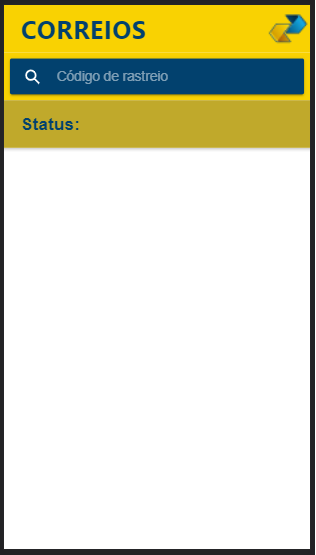
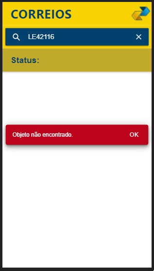
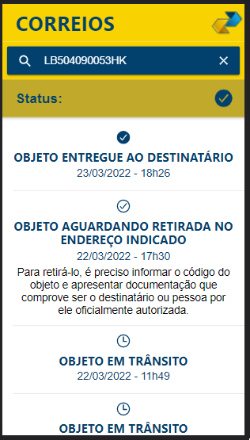

<h1>Rastreador de códigos do Correio</h1>

  
 

  
 

  
 
  Este aplicativo tem como objetivo informar ao usuário em qual etapa a sua encomenda se encontra.
  
  Sua interface é bem simples, uma vez que o aplicativo foi desenvolvido a fim de contribuir com meu aprendizado.

  Tentei personalizar o layout do aplicativo, fazendo parecer ser realmente uma interface do "Correios"
  
  Este aplicativo foi desenvolvido a partir do curso "Ionic 6 do Zero até Publicação" do professor Paulo Rogério Martins Marques.
  
  

    
    
    
  

  
   
  
  Algumas das modificações que fiz:
  
  - Adicionei simbolos para o usuário melhor visualizar as etapas da encomenda 

  - Adicionei uma barra de status que mostra a última notificação da encomenda

  - Cada uma das etapas agora vem com a data e hora
